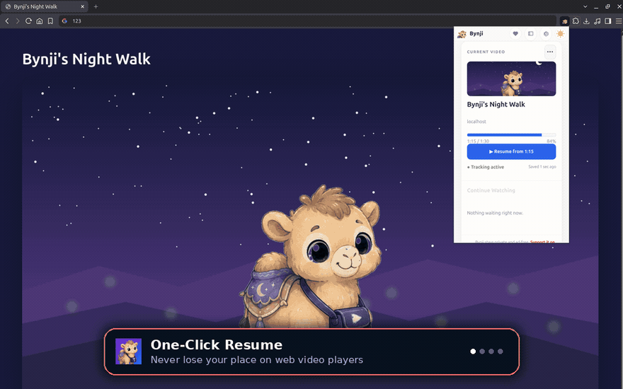

# Bynji Public Website

Static public website and legal pages for **Bynji**.

This repository contains the public product overview, Help guide, support page, Privacy Policy,
Terms, and approved marketing assets. It does **not** contain the Bynji browser extension source
code.

## About Bynji

Bynji is a private, local-first browser extension that remembers meaningful video progress and
viewing history across the web. It helps viewers return to confirmed saved positions while keeping
their Library under their control.

- Automatic progress and viewing-history tracking
- Resume prompts and saved positions
- Organized Library, Trail, and private Insights
- Human-readable and portable exports
- No ads, accounts, or developer-operated analytics

## Pages

- Chrome Web Store: https://chromewebstore.google.com/detail/bynji/bficoegaabaomkpamgkogghmghdmhdac
- Home: https://bynjiapp.github.io/
- Local Sync: https://bynjiapp.github.io/sync.html
- Help: https://bynjiapp.github.io/help.html
- Privacy Policy: https://bynjiapp.github.io/privacy.html
- Terms: https://bynjiapp.github.io/terms.html
- Support: https://bynjiapp.github.io/support.html

## Support Bynji

If Bynji makes watching a little easier, you can support its independent development through
[Ko-fi](https://ko-fi.com/bynji). Support is voluntary and does not unlock core public features.

## Repository contents

- `index.html` — public product homepage
- `sync.html` — Local Sync multi-device setup and privacy explainer
- `help.html` — original Bynji quick guide, troubleshooting, and FAQ
- `privacy.html` — Bynji Privacy Policy
- `terms.html` — Bynji Terms
- `support.html` — voluntary Ko-fi support page
- `site.css` — responsive Bynji styling with dark mode as the default
- `theme.js` — local light/dark switch; it stores only the visitor's theme preference
- `simulator.js` — interactive client-side product demo and simulator
- `assets/` — approved Bynji artwork and product screenshots
- `.nojekyll` — serves the site directly through GitHub Pages without Jekyll processing
- `robots.txt` and `sitemap.xml` — search-engine discovery for the public pages
- `llms.txt` — structured AI agent and LLM search discovery file

## Purpose

This repository exists solely to host Bynji’s public information and legal pages through GitHub
Pages. The site uses no Bynji-operated analytics, advertising, remote JavaScript, or cookies. It
defaults to dark mode and stores an optional light-mode selection only in the visitor's browser.

Product screenshots retain their original proportions. The site does not stretch, squash, or
reframe them with forced aspect ratios.

The Bynji browser extension is maintained separately and is not published in this repository.
